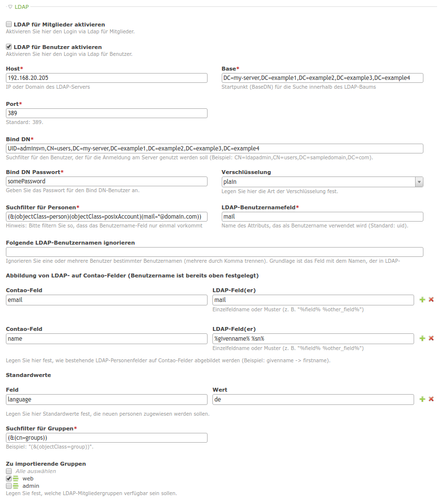

# LDAP

Adds LDAP support for frontend and backend.

*Configuration*

## Technical instructions

- The module defines a "Person" as a contao "Member" or a "User". Both Member and User inherit from Person. This way all relevant functionality is defined in Person superclasses.
- When configuring and saving an LDAP access in tl_settings, all found members (or users) are imported as configured. One could redo this again in order to update all existing local ldap members (or users).
- Local existing members (or users) remotely non existing are disabled, not deleted.
- If LDAP groups have been selected in tl_settings, they're imported and assigned to the appropriate members (or users).
- So local copies of remotely existing members (or users) and groups are created.
- If a member (or user) tries to login with invalid credentials (i.e. credentials are really invalid or a local ldap member (or user) has not been created, yet) a local ldap copy is created on the fly.
- In the frontend "ModuleLdapLogin" has to be used for LDAP support
- The checkCredentials Hook is run everytime a LDAP member (or user) tries to login since after a successful login the password is set to some random value. This is necessary in order to keep local and remote member (or user) up to date.

### Modules

Name | Description
---- | -----------
ModuleLdapLogin | An ldap-extended login module

### Hooks

Name | Arguments | Description
---- | --------- | -----------
ldapAddPerson | $objPerson (instanceof MemberModel or UserModel), $arrSelectedGroups | Triggered after a new person has been added
ldapUpdatePerson | $objPerson (instanceof MemberModel or UserModel), $arrSelectedGroups | Triggered after a person has been updated

### Registered Contao Hooks

Name | Description
---- | -----------
importUser | Called after login credentials have been detected wrong since no local LDAP member (or user) is existing, yet
checkCredentials | Called everytime a LDAP member (or user) is detected -> used for updating local LDAP members (or users) on the fly.